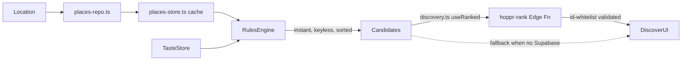
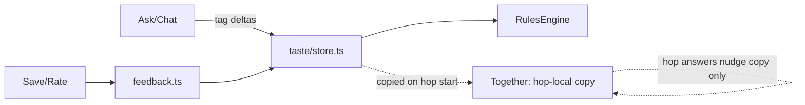
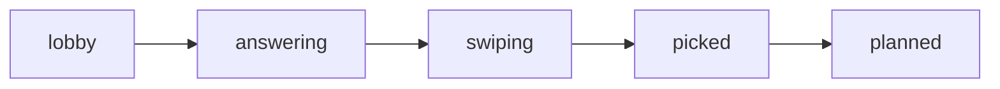

# Architecture

## Discovery / ranking (the hybrid reco flip)

- `src/core/engine/rules.ts` (`RulesEngine`) is always the baseline: computes
  `tasteFit` + proximity + popularity synchronously, entirely local.
- `src/core/discovery.ts`'s `useRanked` is the seam: it takes the rules
  ranking and, only when Supabase is configured, sends the top candidates to
  `hoppr-rank` for Claude re-ordering + reasons. On any failure it falls back
  to the rules ordering.
- `src/core/engine/index.ts` is explicitly NOT the Claude swap point — the
  `RecoEngine` interface is synchronous (called from render in `ask.tsx` /
  `chat.tsx`), so `nextQuestion` stays rules-based indefinitely.

## Ownership: who computes what

| Concern | Owner |
|---|---|
| Candidate generation | `RulesEngine` / `places-repo.ts` |
| Match score / distance / popularity | `RulesEngine` (deterministic math) |
| Ordering + "why" reason (Discover only) | Claude, via `hoppr-rank`, id-whitelisted |
| Next question | `RulesEngine.nextQuestion` (sync, rules only) |
| Menu extraction | Claude vision, via `hoppr-menu` |
| Menu dish pick | `src/core/menu/recommend.ts` (deterministic) |

## Taste flow

`TasteProfile` (`src/core/taste/profile.ts`) is a flat tag-weight vector
(`src/core/taste/tags.ts` is the vocabulary). `tasteFit(profile, place.tags)`
is the only scoring function reused everywhere (Discover, Together, Menu).

## Together (group planning)

State machine lives in `src/core/together/store.ts` (Zustand). Host device is
authoritative. Keyless mode uses 4 seeded bot friends (`bots.ts`) with fixed
tastes; when Supabase is configured, `supabase-sync.ts` registers Realtime so
real joiners replace/augment the bots over the same `Hop` shape
(`together/types.ts`). Group scoring (avg fit + min-veto penalty, unanimous
detection) is in `together/match.ts` — always deterministic, never AI.

## Places

`places-repo.ts` (`fetchNearby`) → `hoppr-places` Edge Function (Google
Places API New `searchNearby`) → best-effort upsert into `places` table
(`source = 'google'`) → `places-store.ts` caches by rounded coords via
react-query. Falls back to the 14 seed places when Supabase isn't configured.
Photos resolve in order: Google Places photo → static map → stripe
placeholder (`src/core/maps.ts`, `src/components/PlaceImage.tsx`).

## Screens

Expo Router (`src/app/`): 5-tab shell (Ask / Discover / Together / You /
list) via `(tabs)/`, plus stack routes `place/[id]`, `category/[id]`,
`chat`, `rate/[id]`, `hop/*`, `menu/[id]`. `GlobalTabBar` renders once in the
root layout below `<Stack>` so tabs persist across pushed routes.
